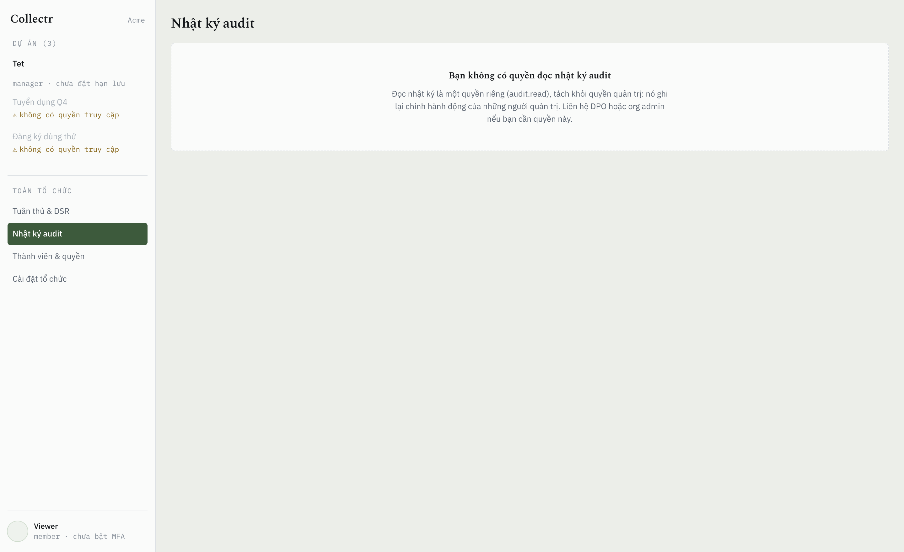

<div align="center">

# Collectr

**Nền tảng thu thập dữ liệu khách hàng mã nguồn mở — rút gọn link, biểu mẫu, và tuân thủ Luật Bảo vệ dữ liệu cá nhân Việt Nam.**

[](LICENSE)
[](https://go.dev)
[](https://www.postgresql.org)
[](docs/)

[Tính năng](#tính-năng) · [Bắt đầu nhanh](#bắt-đầu-nhanh) · [Tài liệu](#tài-liệu) · [API](docs/10-public-api.md) · [Đóng góp](CONTRIBUTING.md)

Tiếng Việt

</div>

---

## Collectr là gì

Bạn tạo một biểu mẫu, Collectr sinh ra link rút gọn và mã QR. Khách hàng quét, điền, gửi. Bạn xem dữ liệu dạng bảng, xuất Excel, và theo dõi phễu chuyển đổi từ lượt quét đến lượt gửi.

Khác biệt nằm ở phần ít ai làm: **mọi lượt đồng ý đều có bằng chứng tái dựng được**, chủ thể dữ liệu tự tra cứu — sửa — yêu cầu xóa được, và mọi thao tác chạm vào dữ liệu cá nhân đều để lại vết không sửa được.

Dùng riêng phần rút gọn cũng được: link, QR, chuyển tiếp UTM, báo cáo lượt bấm theo thời gian và theo chiến dịch, xuất ra Excel. Phần biểu mẫu và consent nằm ngoài đường redirect và không tham gia vào đó.

Lưu ý: rút gọn **có** đo lượt bấm, và Collectr lưu dải mạng /24, họ trình duyệt và tên miền dẫn nguồn cho mỗi lượt. Luật 91/2025 xếp lịch sử hoạt động trên không gian mạng vào **dữ liệu cá nhân cơ bản**, nên đây không phải vùng miễn nghĩa vụ — chỉ là nghĩa vụ nhẹ hơn nhiều so với biểu mẫu. Không lưu địa chỉ IP đầy đủ, không cookie, không nhận diện người qua các lần truy cập.

Thiết kế bám theo **Luật Bảo vệ dữ liệu cá nhân 91/2025/QH15** và **Nghị định 356/2025/NĐ-CP**.

> [!IMPORTANT]
> Collectr là **công cụ hỗ trợ tuân thủ**, không phải sự bảo đảm tuân thủ. Khi bạn tự vận hành, bạn là Bên Kiểm soát dữ liệu và chịu trách nhiệm pháp lý. Hãy để luật sư rà soát cấu hình, văn bản đồng ý và chính sách lưu trữ của bạn trước khi thu thập dữ liệu thật.


<sub>Trình dựng biểu mẫu: sơ đồ nhánh bên trái, câu hỏi ở giữa, thuộc tính dữ liệu cá nhân bên phải.</sub>


**Hàng đợi quyền chủ thể dữ liệu** — hạn gần nhất lên đầu. Quá hạn là rủi ro xử phạt theo NĐ 356/2025, không phải chỉ số nội bộ, nên nó có màu riêng.


**8 vai trò, 16 quyền** — ô `✕` là *cố tình không cấp*: DPO giám sát nhưng không xuất được dữ liệu. Ranh giới ai đó vẽ có chủ đích, không phải chỗ trống.



**Nhật ký chỉ ghi thêm** — mỗi bản ghi mang sha256 của bản ghi trước nó, nên sửa một dòng làm sai hash của chính nó *và của mọi dòng phía sau*. Nút **Kiểm toàn vẹn** tính lại toàn chuỗi. Đây là bằng chứng *phát hiện* can thiệp, không phải chống can thiệp — và role ứng dụng chỉ có `INSERT`/`SELECT` trên bảng này, nên hệ thống đang xử lý dữ liệu cá nhân không thể viết lại hồ sơ về việc mình đã làm.


**Link rút gọn & QR** — hai con số lượt bấm cạnh nhau vì chúng đến từ hai nguồn phủ hai khoảng thời gian khác nhau. Cột "dải mạng" **không phải** số người.

<div align="center">

</div>

**Trang điền form** — 2,6 KB gzip, không framework. Đây là trang khách hàng thật đứng đợi, và là mẫu số của chính tỉ lệ hoàn thành mà sản phẩm này báo cáo.

## Tính năng

**Link & QR**
- Rút gọn URL bất kỳ, alias tùy chọn, hẹn giờ hết hạn
- QR sinh tự động cho mọi link, phân biệt được lượt quét và lượt bấm
- Tên miền riêng cho từng tổ chức

**Biểu mẫu**
- 7 loại câu hỏi: văn bản, chọn một, chọn nhiều, đánh giá, ngày, danh sách thả xuống, tải tệp
- **7 định dạng câu trả lời** kiểm cả hai đầu: email, số điện thoại VN, mã số thuế, CCCD, đường dẫn, số, số nguyên — kèm giới hạn khoảng cho số và ngày
- Tệp đính kèm được nhận dạng bằng magic bytes (đổi đuôi tệp không qua được), mã hóa từng tệp, tải về qua link ký hạn 10 phút và có ghi vết ai tải
- **Rẽ nhánh có điều kiện** như Google Forms / MS Forms
- **Schema có version, bất biến** — sửa biểu mẫu không bao giờ làm hỏng dữ liệu đã thu
- Bảng dữ liệu hợp nhất mọi version, lọc và tìm kiếm

**Tuân thủ PDPL**
- Bản ghi đồng ý riêng cho từng mục đích, kèm bằng chứng tái dựng được
- Rút đồng ý bất cứ lúc nào, không ảnh hưởng tính hợp pháp của xử lý trước đó
- Cổng tự phục vụ cho chủ thể dữ liệu: tra cứu, sửa, yêu cầu xóa — vào bằng liên kết gửi tới email/SĐT, không có mật khẩu để mất
- Chủ thể xem được cả dữ liệu nhạy cảm của chính mình (che sẵn, mở bằng một cú bấm), nhưng không sửa trực tiếp được: sửa nó phải niêm phong lại bằng khóa của họ
- Chính sách lưu trữ theo từng biểu mẫu, tự động xóa hoặc ẩn danh khi hết hạn
- Nhật ký bất biến có chuỗi hash, phát hiện được mọi can thiệp
- Đánh dấu trường nhạy cảm → mã hóa riêng + xóa triệt để bằng crypto-shredding

**Phân tích & báo cáo**
- Phễu quét/bấm → xem biểu mẫu → bắt đầu điền → gửi
- Rơi rớt theo từng trang biểu mẫu
- Xuất Excel nhiều sheet: tổng quan, dữ liệu, thống kê theo câu hỏi, rơi rớt, đồng ý, thông tin xuất
- Mọi tỉ lệ tính trên số người **thực sự được hiển thị** câu hỏi, không phải tổng số bản ghi

**Tích hợp**
- REST API có version, phân trang cursor, API key theo phạm vi
- Webhook có chữ ký HMAC, retry có backoff, nhật ký giao hàng, phát lại được

**Tài khoản**
- Đăng nhập argon2id, xác thực hai lớp TOTP, mã dự phòng cho trường hợp mất điện thoại
- Session lưu trong CSDL nên thu hồi được tức thì, không đợi hết hạn
- Mời đồng nghiệp qua email, đặt lại mật khẩu tự phục vụ

**Vận hành**
- Đa tổ chức, phân quyền theo dự án, 8 vai trò đặt sẵn
- `/metrics` Prometheus: RED theo route, hàng đợi, và các chỉ số nghiệp vụ
- Nhiều tên miền: chạy rút gọn trên `rutgon.example.com`, biểu mẫu trên `form.example.com`
- Rate limit hai tầng cho endpoint công khai
- Tự vận hành bằng một lệnh, không phụ thuộc dịch vụ đám mây nào
- Lưu tệp trên đĩa, hoặc **bất kỳ thứ gì nói giao thức S3**: MinIO, Cloudflare R2, FPT Cloud Object Storage, AWS — khác nhau đúng một dòng endpoint
- Dữ liệu không bao giờ rời khỏi hạ tầng của bạn

## Bắt đầu nhanh

**Yêu cầu:** Docker và Docker Compose.

```bash
git clone https://github.com/Gum97/collectr.git
cd collectr
cp .env.example .env
make secrets          # sinh TENANT_KEK và các khóa bí mật
docker compose up -d
```

Lấy mã khởi tạo. Máy chủ sinh mã này khi khởi động và chỉ in ra chừng nào chưa có chủ sở hữu:

```bash
docker compose logs collectr | grep setup_token
```

Rồi mở `http://localhost/setup`, hoặc gọi thẳng API:

```bash
curl -X POST http://localhost/api/auth/setup -H 'Content-Type: application/json' -d '{
  "token":    "<mã từ log>",
  "org_name": "Công ty ABC",
  "email":    "admin@abc.vn",
  "name":     "Nguyễn Văn A",
  "password": "một mật khẩu đủ dài"
}'
```

**Không có tài khoản mặc định, và sẽ không bao giờ có.** `admin/admin` trên một sản phẩm tự vận hành sống sót trong môi trường thật hàng năm trời, vì không có gì bắt người ta đổi. Mã khởi tạo giải quyết cùng vấn đề theo hướng ngược lại: nó chứng minh người gọi đọc được log của chính máy chủ đó, và nó biến mất ngay khi có chủ sở hữu.

Nó cũng đóng một khoảng trống mà nếu không có thì rất khó thấy: giữa lúc container chạy và lúc bạn mở trình duyệt, một cài đặt mới **chưa có ai sở hữu**. Instance nằm sau TLS tự động sẽ xuất hiện trong Certificate Transparency log trong vòng vài giây, và đó là nơi máy quét đọc. Không có mã thì ai chạm tới trước sẽ thành chủ.

Endpoint này **chỉ chạy được một lần**: sau khi có tài khoản đầu tiên nó trả `409` vĩnh viễn. Tài khoản `owner` bắt buộc bật xác thực hai lớp — có 72 giờ ân hạn để bật, sau đó tài khoản mất quyền cho tới khi bật.

Mời đồng nghiệp (cần `SMTP_*`):

```bash
curl -X POST http://localhost/api/v1/members/invitations -b cookies.txt \
  -H 'Content-Type: application/json' -d '{
  "email": "bao@abc.vn",
  "org_role": "member",
  "project_grants": [{"project_id": "…", "role": "analyst"}]
}'
```

### Cấu hình & triển khai

Biến môi trường, đặt sau Cloudflare/nginx/tunnel, chuyển sang object storage: xem [docs/07-operations.md](docs/07-operations.md#78-cấu-hình--triển-khai).

Ba thứ hay sai nhất, nêu trước ở đây vì chúng đều hỏng **âm thầm**:

- **`SITE_ADDRESS`** không khớp hostname khách truy cập → Caddy trả `200` **thân rỗng**, trang trắng, log toàn 200.
- **`TRUSTED_PROXY_HOPS`** sai → địa chỉ proxy bị ghi vào bản ghi đồng ý thay cho địa chỉ khách, và giới hạn theo IP gộp mọi người vào một hạn mức.
- **`TENANT_KEK`** mất → mọi field nhạy cảm và tệp đã mã hoá không đọc lại được, vĩnh viễn.

Kiểm cái thứ hai bằng mắt: mở **Cài đặt tổ chức** và so dòng *"IP của bạn như hệ thống ghi nhận"* với IP thật của bạn.

## Tài liệu

| | |
|---|---|
| [Yêu cầu & phạm vi](docs/01-requirements.md) | Chức năng, phi chức năng, ranh giới trách nhiệm pháp lý |
| [Ước lượng](docs/02-estimation.md) | Tải, dung lượng, và lý do từng thành phần được phép tồn tại |
| [API](docs/03-api.md) | Contract các endpoint |
| [Mô hình dữ liệu](docs/04-data-model.md) | Schema, chỉ mục, cách ly đa tổ chức |
| [Kiến trúc](docs/05-architecture.md) | Sơ đồ, bản đồ module, luật import |
| [Phân tích chuyên sâu](docs/06-deep-dives.md) | Redirect · versioning ↔ rẽ nhánh · consent/DSR · lưu trữ · bảo mật |
| [Vận hành](docs/07-operations.md) | Giám sát, sao lưu, lộ trình mở rộng |
| [Bảng quyết định](docs/08-decisions.md) | ~35 đánh đổi, mỗi cái kèm phương án bị loại |
| [Báo cáo & Excel](docs/09-reporting-export.md) | Cấu trúc workbook, chỉ số, kiểm soát khi xuất |
| [Public API & Webhooks](docs/10-public-api.md) | API key, quy ước, chữ ký, retry, chống SSRF |
| [Phân quyền](docs/11-rbac.md) | Tổ chức · dự án · vai trò · capability |

## Giao diện

Hai bề mặt, hai cách dựng, có chủ đích:

| | Stack | Bundle (gzip) |
|---|---|---|
| Trang công khai (điền form, cổng DSR) | TypeScript thuần, không framework | **3,3 KB** |
| Quản trị | React + Vite + TanStack Query | 89,5 KB |

Trang điền form là nơi khách hàng thật đứng đợi, và nó là mẫu số của chính tỉ lệ hoàn thành mà sản phẩm này báo cáo. Bắt họ tải runtime của trình dựng biểu mẫu để điền sáu ô là tự bắn vào con số đó.

Bộ luật rẽ nhánh chạy **hai lần** — client để ẩn/hiện câu hỏi, server vì client không đáng tin. Hai bản chấm bằng cùng một tệp `testdata/golden.json`, và bước build Docker chạy test đó trước khi biên dịch: không thể tạo ra một ảnh mà trình duyệt và máy chủ bất đồng về câu hỏi nào bắt buộc.

Node chỉ tồn tại ở tầng build. Ảnh phát hành vẫn là distroless, một binary, asset nhúng sẵn bằng `go:embed`.

```
web/src/shared/   engine.ts     ← chấm bằng golden.json của Go
web/src/public/   form.ts       ← trang công khai
web/src/app/      React         ← quản trị
```

## Kiến trúc

Modular monolith. Một binary Go, một PostgreSQL, một Redis. Không microservices.

```
Client → Caddy → collectr (Go)  ─→ PostgreSQL
                      │          ─→ Redis
                      │          ─→ Local disk | S3
                 collectr-worker ─→ rollup · retention · DSR SLA · webhook · export
```

Các module (`links`, `forms`, `consent`, `dsr`, `analytics`, `iam`) có biên giới import được kiểm tra tự động trong CI. `consent` và `audit` không phụ thuộc vào bất kỳ module nghiệp vụ nào — đó là thứ khiến chúng thực sự là bounded context độc lập, và là đường cắt sẵn nếu về sau cần tách dịch vụ.

Lý do đầy đủ ở [docs/05-architecture.md](docs/05-architecture.md).

## Lộ trình

Đánh dấu theo thứ tự thật, và những gì **chưa** xong nêu thẳng chứ không giấu trong một dấu tick.

- [x] **v0.1 – v0.9** — link/QR, rule engine + versioning bất biến, consent + submit công khai, cổng chủ thể dữ liệu, đăng nhập + TOTP, mời thành viên, upload tệp mã hoá, xuất Excel + webhook
- [x] **v0.10 – v0.13** — load test, `/metrics`, rate limit, quản lý tên miền, báo cáo link, chuyển tiếp UTM
- [x] **v0.14** — Chuyển tiếp UTM, phân tích chiến dịch, xuất báo cáo link ra Excel
- [x] **v0.15** — Giao diện hi-fi, phân quyền theo dự án, cưỡng chế MFA có ân hạn
- [x] **v0.16** — Ba endpoint còn thiếu, API key, danh sách tệp đính kèm
- [x] **v0.17** — 7 định dạng câu trả lời kiểm cả hai đầu, giới hạn min/max, nối xong luồng tải tệp
- [x] **v0.18** — Cổng chủ thể dữ liệu có giao diện thật; chủ thể xem được cả dữ liệu nhạy cảm của mình
- [x] **v0.19** — Mã khởi tạo thay cho tài khoản mặc định; màn Cài đặt tổ chức; lưu trữ S3 (MinIO/R2/FPT/AWS)
- [x] **v0.20** — Sửa chuỗi proxy: giữ IP khách sau Cloudflare/nginx/tunnel, và hiện IP quan sát được ra giao diện
- [x] **v0.21** — Nhân viên sửa hộ khi chủ thể yêu cầu: bắt buộc ghi cách xác minh, sửa và yêu cầu vào cùng một transaction, chủ thể được báo về **cả địa chỉ cũ lẫn mới**
- [x] **v0.22** — Màn lịch sử chỉnh sửa (trước đó chỉ đọc được bằng SQL); sửa ô định danh thì khoá tra cứu của chủ thể đi theo, nếu không họ mất quyền vào chính dữ liệu của mình
- [x] **v0.24** — Script sao lưu/khôi phục có kiểm chứng, và diễn tập thật có bấm giờ trên 156k bản ghi
- [x] **v0.23** — Tìm kiếm ở màn Dữ liệu: bỏ dấu hai chiều (“Nguyen” ra “Nguyễn”), khớp chính xác theo định danh đã băm, và **nói thẳng ô nào không tìm được** thay vì để “không tìm thấy” nói thay

**v1.0 còn lại:**

- [ ] Đo lại trên hạ tầng tách rời — client và server khác máy. Số hiện tại đo trên cùng một Docker VM nên là **sàn, không phải trần**. Chênh lệch redirect giữa các lần đo thì đã đo được: 7 lượt cho p99 **4,3–9,9ms** trong khi **trung vị đứng yên**, nên đó là độ tản của môi trường chứ không phải hồi quy. Nguyên nhân cái đuôi vẫn chưa xác định — giả thuyết "do worker" đã bị bác bỏ bằng thực nghiệm.

Ngoài phạm vi hiện tại: A/B testing, đồng bộ CRM, email marketing, biểu mẫu đa ngôn ngữ, sinh hồ sơ đánh giá tác động tự động.

## Đóng góp

Rất hoan nghênh. Đọc [CONTRIBUTING.md](CONTRIBUTING.md) trước — đặc biệt là phần về những thay đổi chạm vào module `consent` và `audit`, nơi yêu cầu khắt khe hơn phần còn lại của mã nguồn.

Phát hiện lỗ hổng bảo mật? Xin **đừng** mở issue công khai — xem [SECURITY.md](SECURITY.md).

## Giấy phép

[AGPL-3.0](LICENSE).

Chọn AGPL vì Collectr xử lý dữ liệu cá nhân: người dùng cuối có quyền biết phần mềm nào đang giữ dữ liệu của họ, và bất kỳ ai chạy phiên bản sửa đổi dưới dạng dịch vụ đều phải công khai phần sửa đổi đó. Nếu bạn cần giấy phép thương mại cho sản phẩm đóng, liên hệ **info@myservices.io.vn**.

## Ghi nhận

Xây dựng dựa trên [PostgreSQL](https://www.postgresql.org), [Redis](https://redis.io), [Caddy](https://caddyserver.com), [pgx](https://github.com/jackc/pgx), [excelize](https://github.com/qax-os/excelize). Routing uses the standard library — since Go 1.22 `net/http` covers this shape of API without a third-party router.
