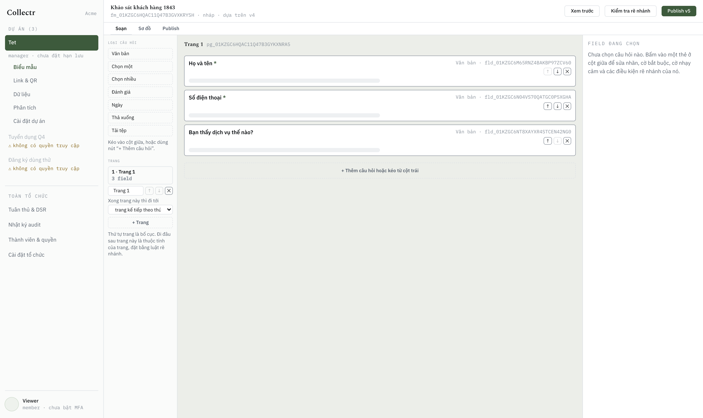
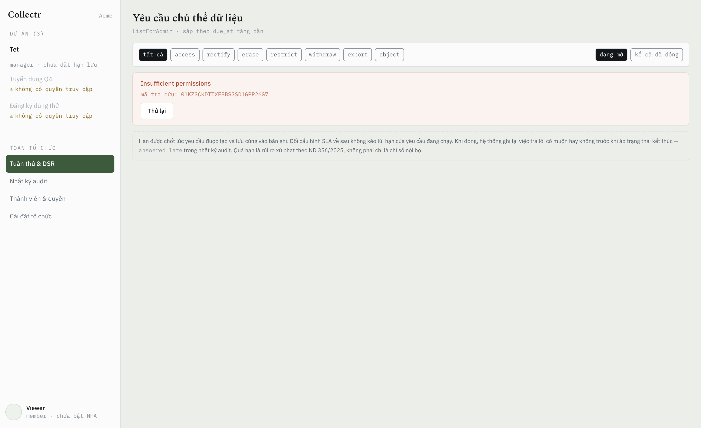
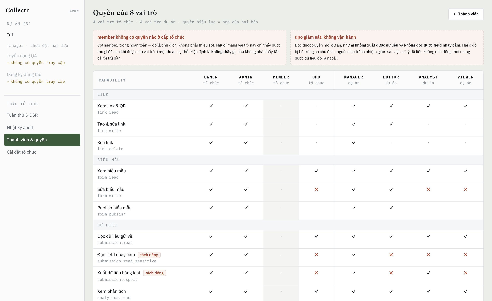
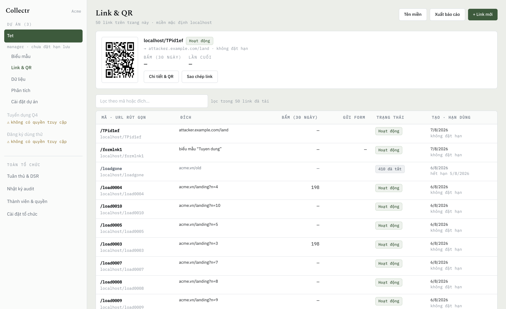
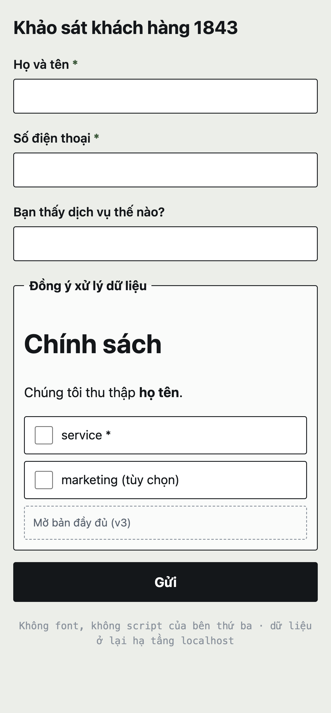

<div align="center">

# Collectr

**Nền tảng thu thập dữ liệu khách hàng mã nguồn mở — rút gọn link, biểu mẫu, và tuân thủ Luật Bảo vệ dữ liệu cá nhân Việt Nam.**

[](LICENSE)
[](https://go.dev)
[](https://www.postgresql.org)
[](docs/)

[Tính năng](#tính-năng) · [Bắt đầu nhanh](#bắt-đầu-nhanh) · [Tài liệu](#tài-liệu) · [API](docs/10-public-api.md) · [Đóng góp](CONTRIBUTING.md)

Tiếng Việt

</div>

---

## Collectr là gì

Bạn tạo một biểu mẫu, Collectr sinh ra link rút gọn và mã QR. Khách hàng quét, điền, gửi. Bạn xem dữ liệu dạng bảng, xuất Excel, và theo dõi phễu chuyển đổi từ lượt quét đến lượt gửi.

Khác biệt nằm ở phần ít ai làm: **mọi lượt đồng ý đều có bằng chứng tái dựng được**, chủ thể dữ liệu tự tra cứu — sửa — yêu cầu xóa được, và mọi thao tác chạm vào dữ liệu cá nhân đều để lại vết không sửa được.

Dùng riêng phần rút gọn cũng được: link, QR, chuyển tiếp UTM, báo cáo lượt bấm theo thời gian và theo chiến dịch, xuất ra Excel. Phần biểu mẫu và consent nằm ngoài đường redirect và không tham gia vào đó.

Lưu ý: rút gọn **có** đo lượt bấm, và Collectr lưu dải mạng /24, họ trình duyệt và tên miền dẫn nguồn cho mỗi lượt. Luật 91/2025 xếp lịch sử hoạt động trên không gian mạng vào **dữ liệu cá nhân cơ bản**, nên đây không phải vùng miễn nghĩa vụ — chỉ là nghĩa vụ nhẹ hơn nhiều so với biểu mẫu. Không lưu địa chỉ IP đầy đủ, không cookie, không nhận diện người qua các lần truy cập.

Thiết kế bám theo **Luật Bảo vệ dữ liệu cá nhân 91/2025/QH15** và **Nghị định 356/2025/NĐ-CP**.

> [!IMPORTANT]
> Collectr là **công cụ hỗ trợ tuân thủ**, không phải sự bảo đảm tuân thủ. Khi bạn tự vận hành, bạn là Bên Kiểm soát dữ liệu và chịu trách nhiệm pháp lý. Hãy để luật sư rà soát cấu hình, văn bản đồng ý và chính sách lưu trữ của bạn trước khi thu thập dữ liệu thật.




<table>
<tr>
<td width="50%"></td>
<td width="50%"></td>
</tr>
<tr>
<td><b>Hàng đợi quyền chủ thể dữ liệu</b><br><sub>Hạn gần nhất lên đầu. Quá hạn là rủi ro xử phạt theo NĐ 356/2025, không phải chỉ số nội bộ — nên nó có màu riêng.</sub></td>
<td><b>8 vai trò, 16 quyền</b><br><sub>Ô <code>✕</code> là <i>cố tình không cấp</i>: DPO giám sát nhưng không xuất được dữ liệu. Ranh giới ai đó vẽ có chủ đích, không phải chỗ trống.</sub></td>
</tr>
<tr>
<td></td>
<td align="center"></td>
</tr>
<tr>
<td><b>Link rút gọn &amp; QR</b><br><sub>Hai con số lượt bấm cạnh nhau vì chúng đến từ hai nguồn phủ hai khoảng thời gian khác nhau. Cột "dải mạng" <b>không phải</b> số người.</sub></td>
<td><b>Trang điền form</b><br><sub>2,6 KB gzip, không framework. Đây là trang khách hàng thật đứng đợi, và là mẫu số của chính tỉ lệ hoàn thành mà sản phẩm này báo cáo.</sub></td>
</tr>
</table>

## Tính năng

**Link & QR**
- Rút gọn URL bất kỳ, alias tùy chọn, hẹn giờ hết hạn
- QR sinh tự động cho mọi link, phân biệt được lượt quét và lượt bấm
- Tên miền riêng cho từng tổ chức

**Biểu mẫu**
- 7 loại câu hỏi: văn bản, chọn một, chọn nhiều, đánh giá, ngày, danh sách thả xuống, tải tệp
- Tệp đính kèm được nhận dạng bằng magic bytes, mã hóa từng tệp, tải về qua link ký có hạn
- **Rẽ nhánh có điều kiện** như Google Forms / MS Forms
- **Schema có version, bất biến** — sửa biểu mẫu không bao giờ làm hỏng dữ liệu đã thu
- Bảng dữ liệu hợp nhất mọi version, lọc và tìm kiếm

**Tuân thủ PDPL**
- Bản ghi đồng ý riêng cho từng mục đích, kèm bằng chứng tái dựng được
- Rút đồng ý bất cứ lúc nào, không ảnh hưởng tính hợp pháp của xử lý trước đó
- Cổng tự phục vụ cho chủ thể dữ liệu: tra cứu, sửa, yêu cầu xóa
- Chính sách lưu trữ theo từng biểu mẫu, tự động xóa hoặc ẩn danh khi hết hạn
- Nhật ký bất biến có chuỗi hash, phát hiện được mọi can thiệp
- Đánh dấu trường nhạy cảm → mã hóa riêng + xóa triệt để bằng crypto-shredding

**Phân tích & báo cáo**
- Phễu quét/bấm → xem biểu mẫu → bắt đầu điền → gửi
- Rơi rớt theo từng trang biểu mẫu
- Xuất Excel nhiều sheet: tổng quan, dữ liệu, thống kê theo câu hỏi, rơi rớt, đồng ý, thông tin xuất
- Mọi tỉ lệ tính trên số người **thực sự được hiển thị** câu hỏi, không phải tổng số bản ghi

**Tích hợp**
- REST API có version, phân trang cursor, API key theo phạm vi
- Webhook có chữ ký HMAC, retry có backoff, nhật ký giao hàng, phát lại được

**Tài khoản**
- Đăng nhập argon2id, xác thực hai lớp TOTP, mã dự phòng cho trường hợp mất điện thoại
- Session lưu trong CSDL nên thu hồi được tức thì, không đợi hết hạn
- Mời đồng nghiệp qua email, đặt lại mật khẩu tự phục vụ

**Vận hành**
- Đa tổ chức, phân quyền theo dự án, 8 vai trò đặt sẵn
- `/metrics` Prometheus: RED theo route, hàng đợi, và các chỉ số nghiệp vụ
- Nhiều tên miền: chạy rút gọn trên `rutgon.example.com`, biểu mẫu trên `form.example.com`
- Rate limit hai tầng cho endpoint công khai
- Tự vận hành bằng một lệnh, không phụ thuộc dịch vụ đám mây nào
- Dữ liệu không bao giờ rời khỏi hạ tầng của bạn

## Bắt đầu nhanh

**Yêu cầu:** Docker và Docker Compose.

```bash
git clone https://github.com/<org>/collectr.git
cd collectr
cp .env.example .env
make secrets          # sinh TENANT_KEK và các khóa bí mật
docker compose up -d
```

Tạo tổ chức và tài khoản chủ sở hữu đầu tiên:

```bash
curl -X POST http://localhost/api/auth/setup -H 'Content-Type: application/json' -d '{
  "org_name": "Công ty ABC",
  "email":    "admin@abc.vn",
  "name":     "Nguyễn Văn A",
  "password": "một mật khẩu đủ dài"
}'
```

Endpoint này **chỉ chạy được một lần**: sau khi có tài khoản đầu tiên nó tự đóng vĩnh viễn. Tài khoản `owner` bắt buộc bật xác thực hai lớp — đăng nhập lần đầu sẽ trả `mfa_setup_required: true`.

Mời đồng nghiệp (cần `SMTP_*`):

```bash
curl -X POST http://localhost/api/v1/members/invitations -b cookies.txt \
  -H 'Content-Type: application/json' -d '{
  "email": "bao@abc.vn",
  "org_role": "member",
  "project_grants": [{"project_id": "…", "role": "analyst"}]
}'
```

> [!WARNING]
> `make secrets` sinh ra `TENANT_KEK` trong `.env`. **Sao lưu khóa này ở nơi tách biệt với bản sao lưu cơ sở dữ liệu.** Mất nó là mất vĩnh viễn mọi trường nhạy cảm và mọi tệp đã mã hóa — không có đường khôi phục. Đó chính là thuộc tính khiến tính năng xóa triệt để hoạt động.

### Cấu hình

| Biến môi trường | Mặc định | Ý nghĩa |
|---|---|---|
| `BASE_URL` | `http://localhost:8080` | Origin của ứng dụng: trang biểu mẫu, cổng DSR, API quản trị |
| `SHORT_URL_BASE` | `BASE_URL` | Origin của link rút gọn. Đặt riêng để chạy shortener trên tên miền của nó |
| `DATABASE_URL` | — | Chuỗi kết nối PostgreSQL |
| `REDIS_URL` | — | Chuỗi kết nối Redis |
| `TENANT_KEK` | — | **Bắt buộc.** Khóa gốc mã hóa, 32 byte base64 |
| `STORAGE_DRIVER` | `local` | `local` hoặc `s3` |
| `STORAGE_LOCAL_PATH` | `/data/files` | Thư mục lưu tệp khi dùng `local` |
| `STORAGE_S3_*` | — | Endpoint, bucket, khóa truy cập khi dùng `s3` |
| `DSR_SLA_HOURS` | `72` | Hạn xử lý yêu cầu của chủ thể dữ liệu |
| `DEFAULT_RETENTION_DAYS` | `730` | Thời hạn lưu mặc định |
| `RAW_EVENT_RETENTION_DAYS` | `90` | Thời hạn lưu sự kiện thô |
| `DEPLOYMENT_ROLE` | `controller` | `controller` (tự dùng) hoặc `processor` (chạy dịch vụ cho bên khác) |

| `SMTP_HOST` `SMTP_FROM` | — | Bắt buộc để mời đồng nghiệp và để chủ thể dữ liệu nhận được liên kết truy cập |

> [!WARNING]
> Chưa cấu hình SMTP thì lời mời và liên kết truy cập được **ghi ra log thay vì gửi đi**. Dùng để thử được, **không dùng thật được** — người khác không đọc được log của bạn.
>
> Thử tại chỗ: `docker compose --profile dev up -d mailpit`, đặt `SMTP_HOST=mailpit` `SMTP_PORT=1025` `SMTP_STARTTLS=false`, rồi đọc mail ở http://localhost:8025

Danh sách đầy đủ: [`.env.example`](.env.example).

### Chuyển sang object storage

Khi dung lượng tệp vượt ~300 GB, hoặc khi chạy nhiều hơn một instance:

```bash
STORAGE_DRIVER=s3
STORAGE_S3_ENDPOINT=http://minio:9000
STORAGE_S3_BUCKET=collectr
```
```bash
docker compose --profile s3 up -d      # kèm MinIO
```

Không cần sửa dòng code nào — cả hai driver dùng chung một giao diện `Storage`. Job chép dữ liệu từ `local` sang `s3` (kèm đối chiếu checksum) sẽ có ở v0.2.

## Tài liệu

| | |
|---|---|
| [Yêu cầu & phạm vi](docs/01-requirements.md) | Chức năng, phi chức năng, ranh giới trách nhiệm pháp lý |
| [Ước lượng](docs/02-estimation.md) | Tải, dung lượng, và lý do từng thành phần được phép tồn tại |
| [API](docs/03-api.md) | Contract các endpoint |
| [Mô hình dữ liệu](docs/04-data-model.md) | Schema, chỉ mục, cách ly đa tổ chức |
| [Kiến trúc](docs/05-architecture.md) | Sơ đồ, bản đồ module, luật import |
| [Phân tích chuyên sâu](docs/06-deep-dives.md) | Redirect · versioning ↔ rẽ nhánh · consent/DSR · lưu trữ · bảo mật |
| [Vận hành](docs/07-operations.md) | Giám sát, sao lưu, lộ trình mở rộng |
| [Bảng quyết định](docs/08-decisions.md) | ~35 đánh đổi, mỗi cái kèm phương án bị loại |
| [Báo cáo & Excel](docs/09-reporting-export.md) | Cấu trúc workbook, chỉ số, kiểm soát khi xuất |
| [Public API & Webhooks](docs/10-public-api.md) | API key, quy ước, chữ ký, retry, chống SSRF |
| [Phân quyền](docs/11-rbac.md) | Tổ chức · dự án · vai trò · capability |

## Giao diện

Hai bề mặt, hai cách dựng, có chủ đích:

| | Stack | Bundle (gzip) |
|---|---|---|
| Trang công khai (điền form, cổng DSR) | TypeScript thuần, không framework | **3,3 KB** |
| Quản trị | React + Vite + TanStack Query | 89,5 KB |

Trang điền form là nơi khách hàng thật đứng đợi, và nó là mẫu số của chính tỉ lệ hoàn thành mà sản phẩm này báo cáo. Bắt họ tải runtime của trình dựng biểu mẫu để điền sáu ô là tự bắn vào con số đó.

Bộ luật rẽ nhánh chạy **hai lần** — client để ẩn/hiện câu hỏi, server vì client không đáng tin. Hai bản chấm bằng cùng một tệp `testdata/golden.json`, và bước build Docker chạy test đó trước khi biên dịch: không thể tạo ra một ảnh mà trình duyệt và máy chủ bất đồng về câu hỏi nào bắt buộc.

Node chỉ tồn tại ở tầng build. Ảnh phát hành vẫn là distroless, một binary, asset nhúng sẵn bằng `go:embed`.

```
web/src/shared/   engine.ts     ← chấm bằng golden.json của Go
web/src/public/   form.ts       ← trang công khai
web/src/app/      React         ← quản trị
```

## Kiến trúc

Modular monolith. Một binary Go, một PostgreSQL, một Redis. Không microservices.

```
Client → Caddy → collectr (Go)  ─→ PostgreSQL
                      │          ─→ Redis
                      │          ─→ Local disk | S3
                 collectr-worker ─→ rollup · retention · DSR SLA · webhook · export
```

Các module (`links`, `forms`, `consent`, `dsr`, `analytics`, `iam`) có biên giới import được kiểm tra tự động trong CI. `consent` và `audit` không phụ thuộc vào bất kỳ module nghiệp vụ nào — đó là thứ khiến chúng thực sự là bounded context độc lập, và là đường cắt sẵn nếu về sau cần tách dịch vụ.

Lý do đầy đủ ở [docs/05-architecture.md](docs/05-architecture.md).

## Lộ trình

- [x] Thiết kế hệ thống
- [x] **v0.1** — Link + QR + redirect + thu thập sự kiện async *(đang hoàn thiện: quản lý workspace/user)*
- [x] **v0.2** — Rule engine, versioning bất biến, validator lúc publish, bảng dữ liệu *(chưa có endpoint submit công khai — xem v0.3)*
- [x] **v0.3** — Consent + endpoint submit, nhật ký bất biến, crypto-shredding *(cổng tự phục vụ chủ thể dữ liệu chuyển sang v0.4)*
- [x] **v0.4** — Cổng chủ thể dữ liệu: tra cứu, sửa, yêu cầu xóa; retention sweeper; xử lý DSR tự động
- [x] **v0.5** — Đăng nhập (argon2id + TOTP), session thu hồi được, phân giải quyền
- [x] **v0.6** — SMTP, mời thành viên, quản lý thành viên
- [x] **v0.7** — Đặt lại mật khẩu, đổi mật khẩu, mã dự phòng MFA
- [x] **v0.8** — Upload tệp: kiểm magic bytes, mã hóa at-rest, link ký, dọn tệp bỏ rơi
- [x] **v0.9** — Xuất Excel nhiều sheet, webhook có chữ ký, engine báo cáo
- [x] **v0.10** — Load test, beacon phễu, hàng đợi DSR cho quản trị
- [x] **v0.11** — `/metrics` Prometheus, rate limit endpoint công khai, CRUD dự án & biểu mẫu
- [x] **v0.12** — Quản lý tên miền, tách tên miền rút gọn khỏi tên miền ứng dụng
- [x] **v0.13** — Báo cáo cho link rút gọn: lượt bấm theo thời gian, nguồn, QR, xếp hạng
- [x] **v0.15** — Giao diện hi-fi, phân quyền theo dự án, cưỡng chế MFA có ân hạn
- [x] **v0.14** — Chuyển tiếp UTM, phân tích chiến dịch, xuất báo cáo link ra Excel
- [ ] **v1.0** — Ba endpoint còn thiếu (phễu, legal hold, so sánh version), API key, cứng hoá bảo mật, đo lại trên hạ tầng tách rời

Ngoài phạm vi hiện tại: A/B testing, đồng bộ CRM, email marketing, biểu mẫu đa ngôn ngữ, sinh hồ sơ đánh giá tác động tự động.

## Đóng góp

Rất hoan nghênh. Đọc [CONTRIBUTING.md](CONTRIBUTING.md) trước — đặc biệt là phần về những thay đổi chạm vào module `consent` và `audit`, nơi yêu cầu khắt khe hơn phần còn lại của mã nguồn.

Phát hiện lỗ hổng bảo mật? Xin **đừng** mở issue công khai — xem [SECURITY.md](SECURITY.md).

## Giấy phép

[AGPL-3.0](LICENSE).

Chọn AGPL vì Collectr xử lý dữ liệu cá nhân: người dùng cuối có quyền biết phần mềm nào đang giữ dữ liệu của họ, và bất kỳ ai chạy phiên bản sửa đổi dưới dạng dịch vụ đều phải công khai phần sửa đổi đó. Nếu bạn cần giấy phép thương mại cho sản phẩm đóng, hãy liên hệ.

## Ghi nhận

Xây dựng dựa trên [PostgreSQL](https://www.postgresql.org), [Redis](https://redis.io), [Caddy](https://caddyserver.com), [pgx](https://github.com/jackc/pgx), [excelize](https://github.com/qax-os/excelize). Routing uses the standard library — since Go 1.22 `net/http` covers this shape of API without a third-party router.
