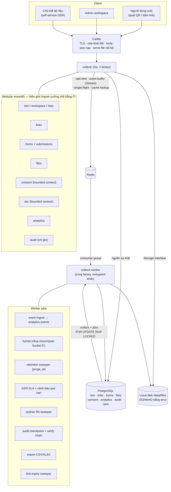

# 5. Kiến trúc tổng thể

## 5.1 Sơ đồ



Bốn container. Không có gì trong sơ đồ mà [bước 2](02-estimation.md#25-component-nào-được-phép-tồn-tại) không biện minh được bằng số.

## 5.2 Bản đồ package Go

```
cmd/
  collectr/main.go              # API server
  collectr-worker/main.go       # worker — cùng go.mod, cùng image, khác entrypoint
internal/
  platform/                     # httpx, db, redis, storage, queue, crypto, tenant, telemetry, ratelimit
  contracts/                    # INTERFACE + DTO công khai — chỗ DUY NHẤT module này thấy module kia
    consent.go                  #   Recorder, ConsentChecker, SubjectResolver
    links.go                    #   Resolver
    forms.go                    #   SchemaProvider
    files.go                    #   Binder
    audit.go                    #   Writer
  modules/
    iam/       {api, app, domain, store}
    links/     {api, app, domain, store}
    forms/     {api, app, domain, store, engine}   # engine = rule evaluator, hàm thuần
    files/     {api, app, domain, store}
    consent/   {api, app, domain, store}
    dsr/       {api, app, domain}                  # điều phối, không sở hữu bảng riêng ngoài dsr_requests
    analytics/ {api, app, store}
    audit/     {app, store}
```

## 5.3 Luật import — cưỡng chế bằng test CI

Một test chạy `go list -deps ./...` đối chiếu allowlist. Vi phạm = fail build.

1. `modules/X/store` **chỉ** được import bởi `modules/X/**`.
2. Module chỉ import `contracts` của module khác, **không bao giờ** import package nội bộ của module khác.
3. **`consent` và `audit` không được import bất kỳ module nghiệp vụ nào.** Phụ thuộc một chiều — đây là thứ khiến chúng thực sự là bounded context, không phải "thư mục đặt tên nghe hay".
4. Không SQL JOIN xuyên schema. Giao tiếp qua interface (đồng bộ, trong cùng transaction khi cần atomic) hoặc `core.outbox` (bất đồng bộ).
5. `platform/*` không import `modules/*`.

### Vì sao consent/dsr là bounded context riêng

| Lý do | Cụ thể |
|---|---|
| Ngôn ngữ khác hẳn | "chủ thể dữ liệu", "mục đích", "căn cứ pháp lý", "bằng chứng" — không có khái niệm nào trong đó thuộc về forms hay links |
| Vòng đời khác | Consent record sống lâu hơn submission (rút đồng ý xong vẫn phải giữ bằng chứng về việc đã từng đồng ý) |
| Người thay đổi khác | Luật đổi → chỉ module này đổi. Thêm loại field mới → module này không đụng gì |
| Yêu cầu bảo mật khác | Append-only, DB role riêng, không cho phép sửa |
| Đường tách service rõ | Nếu về sau cần dịch vụ consent dùng chung cho nhiều sản phẩm, cắt ở đúng đây |

Giao diện duy nhất mà module khác thấy:
```go
// internal/contracts/consent.go
type Recorder interface {
    // Ghi consent TRONG CÙNG transaction với dữ liệu nghiệp vụ.
    Record(ctx context.Context, tx pgx.Tx, in RecordConsentInput) ([]ConsentRecord, error)
}
type ConsentChecker interface {
    HasActive(ctx context.Context, subjectID uuid.UUID, purpose string) (bool, error)
}
type SubjectResolver interface {
    UpsertSubject(ctx context.Context, tx pgx.Tx, tenantID uuid.UUID, kind, value string) (Subject, error)
}
```
`Record` nhận `tx` từ bên gọi — đây là cách giữ tính atomic **mà không phá ranh giới module**: forms không biết bảng nào của consent bị đụng, nhưng vẫn đảm bảo hai bên cùng commit hoặc cùng rollback.

## 5.4 Đường tách service tương lai (nếu bao giờ cần)

Đã sẵn, không phải viết lại:

```
contracts/     → sinh gRPC stub
schema Postgres → tách thành DB riêng (đã phân tách sẵn)
core.outbox    → đổi relay từ in-process sang NATS/Rabbit
modules/X/api  → thành cmd/X-service
```
Thứ tự rút theo strangler fig, **chỉ khi có số liệu** ([7.4](07-operations.md#74-scaling-path)).

## 5.5 docker-compose

```yaml
services:
  # Chạy một lần, bằng role owner, trước mọi thứ khác.
  # API server KHÔNG tự migrate lúc boot: nó chạy bằng role cố tình không có
  # quyền DDL. Cho nó migrate = cấp cho nó quyền tạo/xóa bảng, đúng thứ RLS
  # đang cố ngăn.
  migrate:
    build: .
    command: ["/collectr", "-migrate"]
    restart: "no"
    depends_on:
      postgres: {condition: service_healthy}

  caddy:
    image: caddy:2
    ports: ["80:80", "443:443"]
    volumes: [./Caddyfile:/etc/caddy/Caddyfile, caddy_data:/data, files:/srv/files:ro]

  collectr:
    image: ghcr.io/…/collectr:latest
    environment:
      DATABASE_URL: postgres://collectr:…@postgres:5432/collectr
      REDIS_URL: redis://redis:6379
      STORAGE_DRIVER: local            # local | s3
      STORAGE_LOCAL_PATH: /data/files
      # STORAGE_S3_ENDPOINT / _BUCKET / _ACCESS_KEY / _SECRET_KEY  ← đổi driver là xong
      TENANT_KEK: ${TENANT_KEK}        # 32 byte base64, BẮT BUỘC, mất là mất dữ liệu nhạy cảm
      DSR_SLA_HOURS: 72
      DEFAULT_RETENTION_DAYS: 730
      RAW_EVENT_RETENTION_DAYS: 90
      DEPLOYMENT_ROLE: controller      # controller | processor
    volumes: [files:/data/files]
    depends_on:
      postgres: {condition: service_healthy}
      redis: {condition: service_healthy}
      migrate: {condition: service_completed_successfully}

  worker:
    image: ghcr.io/…/collectr:latest
    command: ["/collectr-worker"]
    environment: *same
    volumes: [files:/data/files]

  postgres:
    image: postgres:17
    volumes: [pgdata:/var/lib/postgresql/data]

  redis:
    image: redis:7
    command: >
      redis-server --maxmemory 512mb --maxmemory-policy allkeys-lru
      --appendonly yes
volumes: { pgdata: , files: , caddy_data: }
```

**Hai role DB, không phải một.** RLS policy **không áp dụng cho owner của bảng** — nếu app kết nối bằng role owner thì mọi policy ở [4.2](04-data-model.md#42-multi-tenancy) trở thành đồ trang trí. Nên: API server dùng `collectr_app` (bị RLS ràng buộc, không có quyền DDL), worker dùng owner (rollup/retention/partition vốn xuyên tenant), migrate chạy riêng bằng owner. Redirect — path duy nhất không thể biết tenant trước khi query — đi qua hàm `links.resolve()` SECURITY DEFINER thay vì cấp BYPASSRLS cho cả app.

**Dockerfile dùng `CMD`, không dùng `ENTRYPOINT`.** Compose `command:` **thay thế** CMD nhưng chỉ **nối thêm** vào ENTRYPOINT. Với ENTRYPOINT, worker sẽ exec `/collectr /collectr-worker`, mà Go `flag` dừng parse ở positional argument đầu tiên → mọi service đều lặng lẽ chạy API server với flag bị bỏ qua. Lỗi này không làm container chết, nên nó chỉ lộ ra khi có người kiểm tra thật.

**Chế độ solo:** cờ `RUN_WORKER_INLINE=true` gộp worker vào process app → còn 3 container cho ai chỉ muốn thử. Mặc định vẫn tách vì lý do ở [2.5](02-estimation.md#25-component-nào-được-phép-tồn-tại).

**Redis `maxmemory` + eviction policy khai báo tường minh** — mặc định "phình đến khi OOM" không phải một chính sách. `appendonly yes` vì Redis Stream đang giữ event chưa kịp ingest; mất là mất analytics (chấp nhận được) nhưng không có lý do gì để chấp nhận vô cớ.
